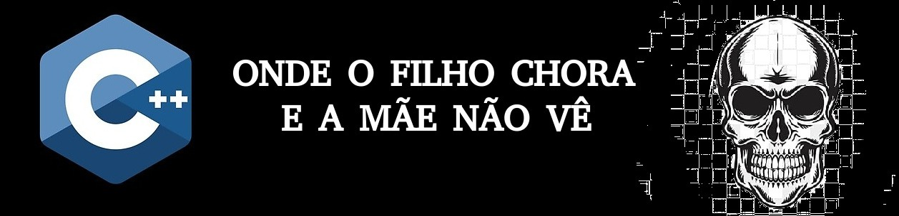

# CONTEÚDO DAS AULAS DE RICARDO #

Material pessoal da disciplina C++; 

Lista de vetores na pasta *listaVetores*, questões resolvidas: 

1. resolvida;
2. resolvida;
3. resolvida;
4. resolvida; 
5. resolvida;
6. resolvida;
7. resolvida;
8. resolvida;
9. unsolved;
10. unsolved;
